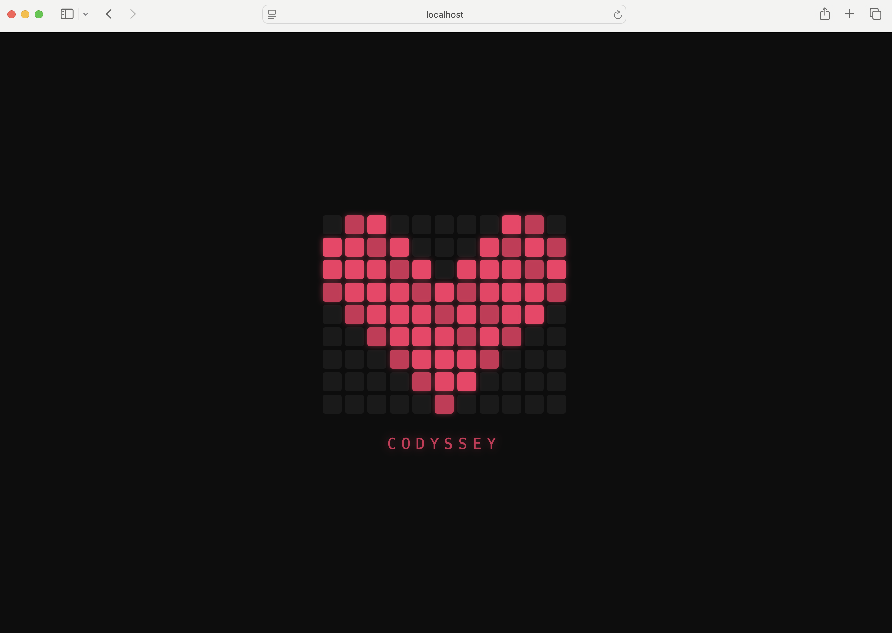

# 개발 워크스테이션 구축

## 목차
1. [프로젝트 개요](#1-프로젝트-개요)
2. [실행 환경](#2-실행-환경)
3. [수행 항목 체크리스트](#3-수행-항목-체크리스트)
4. [터미널 기본 조작](#4-터미널-기본-조작)
5. [파일 권한 실습](#5-파일-권한-실습)
6. [Docker 설치 및 점검](#6-docker-설치-및-점검)
7. [Docker 기본 운영](#7-docker-기본-운영)
8. [커스텀 이미지 제작 (Dockerfile)](#8-커스텀-이미지-제작-dockerfile)
9. [포트 매핑 및 접속 증거](#9-포트-매핑-및-접속-증거)
10. [바인드 마운트](#10-바인드-마운트)
11. [Docker 볼륨 영속성](#11-docker-볼륨-영속성)
12. [Git 설정 및 GitHub 연동](#12-git-설정-및-github-연동)
13. [트러블슈팅](#13-트러블슈팅)

## 1. 프로젝트 개요

개발 환경을 직접 세팅하고 운영하는 경험을 통해,
터미널 · Docker · Git이라는 핵심 도구의 사용법과 설계 원칙을 익힌다.

### 미션 목표

- 터미널(CLI)로 작업 디렉토리와 파일 권한을 직접 다룬다
- Docker를 설치·점검하고, 컨테이너를 실행·관리한다
- Dockerfile로 커스텀 이미지를 빌드하고 웹 서버를 컨테이너화한다
- 포트 매핑 · 바인드 마운트 · 볼륨으로 연결과 데이터 영속성을 검증한다
- Git 설정과 GitHub 연동으로 버전 관리 기반을 완성한다

### 학습 포인트

| 항목 | 학습 포인트 |
|------|-----------|
| Linux CLI | 경로, 파일 조작, 권한(r/w/x) |
| Docker | 이미지/컨테이너 분리, 포트·스토리지 연결 |
| Git / GitHub | 로컬 버전관리 vs 원격 협업 플랫폼의 차이 |

## 2. 실행 환경

| 항목 | 내용 | 명령어 |
|------|------|-------------|
| OS | Darwin 24.6.0 | `uname -a` |
| Shell | zsh | `echo $SHELL` |
| Terminal | VSCode 통합 터미널 | - |
| Docker | 28.5.2 | `docker --version` |
| Git | 2.53.0 | `git --version` |
### 명령어 실행 결과

```bash
$ uname -a
Darwin c3r9s3.codyssey.kr 24.6.0 Darwin Kernel Version 24.6.0: Mon Jan 19 22:00:10 PST 2026; root:xnu-11417.140.69.708.3~1/RELEASE_X86_64 x86_64

$ echo $SHELL
/bin/zsh

$ docker --version
Docker version 28.5.2, build ecc6942

$ git --version
git version 2.53.0
```


## 3. 수행 항목 체크리스트

### 터미널 기본 조작
| 상태 | 항목 | 명령어 |
|------|------|--------|
| [x] | 현재 위치 확인 | `pwd` |
| [x] | 목록 확인 (숨김 파일 포함) | `ls -al` |
| [x] | 디렉토리 생성 | `mkdir` |
| [x] | 디렉토리 이동 | `cd` |
| [x] | 빈 파일 생성 | `touch` |
| [x] | 파일 내용 작성 | `echo` |
| [x] | 파일 내용 확인 | `cat` |
| [x] | 파일 복사 | `cp` |
| [x] | 파일 이동/이름변경 | `mv` |
| [x] | 파일/디렉토리 삭제 | `rm`, `rmdir` |

### 파일 권한
| 상태 | 항목 | 명령어 |
|------|------|--------|
| [x] | 권한 확인 | `ls -l` |
| [x] | 파일/디렉토리 권한 변경 | `chmod` |

### Docker 설치 및 점검
| 상태 | 항목 | 명령어 |
|------|------|--------|
| [x] | Docker 버전 확인 | `docker --version` |
| [x] | Docker 데몬 동작 확인 | `docker info` |

### Docker 기본 운영
| 상태 | 항목 | 명령어 |
|------|------|--------|
| [x] | 이미지 다운로드 | `docker pull` |
| [x] | 이미지 목록 확인 | `docker images` |
| [x] | 컨테이너 실행 | `docker run` |
| [x] | 컨테이너 목록 확인 | `docker ps`, `docker ps -a` |
| [x] | 로그 확인 | `docker logs` |
| [x] | 리소스 확인 | `docker stats` |

### 컨테이너 실행 실습
| 상태 | 항목 | 명령어 |
|------|------|--------|
| [x] | hello-world 실행 | `docker run hello-world` |
| [x] | ubuntu 컨테이너 진입 및 내부 명령 수행 | `docker run -it ubuntu` |
| [x] | attach/exec 차이 정리 | - |

### 커스텀 이미지 제작
| 상태 | 항목 | 명령어 |
|------|------|--------|
| [x] | Dockerfile 작성 | - |
| [x] | 이미지 빌드 | `docker build` |
| [x] | 컨테이너 실행 성공 | `docker run` |

### 포트 매핑
| 상태 | 항목 | 명령어 |
|------|------|--------|
| [x] | 포트 매핑 실행 | `docker run -p` |
| [ ] | 브라우저 접속 성공 화면 첨부 | - |

### 바인드 마운트
| 상태 | 항목 | 명령어 |
|------|------|--------|
| [x] | 바인드 마운트 실행 | `docker run -v` |
| [x] | 호스트 파일 변경 후 컨테이너 반영 확인 | - |

### Docker 볼륨
| 상태 | 항목 | 명령어 |
|------|------|--------|
| [x] | 볼륨 생성 | `docker volume create` |
| [x] | 볼륨 연결 후 데이터 저장 | `docker run -v` |
| [x] | 컨테이너 삭제 후 데이터 유지 확인 | `docker rm` |

### Git / GitHub
| 상태 | 항목 | 명령어 |
|------|------|--------|
| [ ] | Git 사용자 정보 설정 | `git config --global user.name` |
| [ ] | 기본 브랜치 설정 | `git config --global init.defaultBranch` |
| [x] | git config --list 결과 기록 | `git config --list` |
| [x] | GitHub 저장소 연동 확인 | `git remote -v` |

### 트러블슈팅
| 상태 | 항목 | 명령어 |
|------|------|--------|
| [x] | 발생한 문제 상황 정리 | - |
| [x] | 원인 분석 및 해결 방법 기록 | - |
| [x] | 재발 방지 포인트 정리 | - |

## 4. 터미널 기본 조작

### 현재 위치 확인
```bash
$ pwd
/Users/pwndud04218647/Documents/codyssey1
```

### 목록 확인 (숨김 파일 포함)
```bash
$ ls -al
total 8
drwxr-xr-x   4 pwndud04218647  pwndud04218647  128 Apr  3 19:44 .
drwx------+  4 pwndud04218647  pwndud04218647  128 Apr  3 19:44 ..
drwxr-xr-x  13 pwndud04218647  pwndud04218647  416 Apr  3 19:47 .git
-rw-r--r--   1 pwndud04218647  pwndud04218647  820 Apr  3 19:46 README.md
```

### 디렉토리 생성
```bash
$ mkdir sub
$ ls
README.md       sub
```

### 디렉토리 이동
```bash
$ cd sub
$ pwd
/Users/pwndud04218647/Documents/codyssey1/sub
```

### 빈 파일 생성
```bash
$ touch hello.txt
$ ls
hello.txt
```

### 파일 내용 작성
```bash
$ echo "Hello World" > hello.txt
$ cat hello.txt
Hello World
```

### 파일 복사
```bash
$ cp hello.txt hello_copy.txt
$ ls
hello_copy.txt  hello.txt
```

### 파일 이동/이름변경
```bash
# 파일 이동
$ mv hello_copy.txt ../hello_copy.txt
$ cd ..
$ ls
hello_copy.txt  README.md       sub

# 파일 이름변경
$ mv hello_copy.txt hello_renamed.txt
$ ls
hello_renamed.txt       README.md               sub
```

### 파일/디렉토리 삭제
```bash
# 파일 삭제
$ rm hello_renamed.txt
$ ls
README.md       sub

# 디렉토리 삭제
$ rm -r sub # 파일이 들어있는 디렉토리 삭제
$ rmdir sub # 빈 디렉토리인 경우만 삭제
$ ls
README.md
```


## 5. 파일 권한 실습

### 권한 표기 읽는 법
| 문자 | 의미 (8진수) |
|------|------|
| r | 읽기 (4) |
| w | 쓰기 (2) |
| x | 실행 (1) |
| - | 권한 없음 (0) |

권한은 owner / group / others 순서로 3자리씩 표기된다.

### 파일 권한 변경 실습

```bash
# 파일/디렉토리 생성
$ touch test_file.txt
$ mkdir test_dir
$ ls -l
total 8
-rw-r--r--  1 pwndud04218647  pwndud04218647  820 Apr  3 19:46 README.md
drwxr-xr-x  2 pwndud04218647  pwndud04218647   64 Apr  3 21:19 test_dir
-rw-r--r--  1 pwndud04218647  pwndud04218647    0 Apr  3 21:19 test_file.txt

# 파일 권한 변경: 644 → 750
$ chmod 750 test_file.txt

# 디렉토리 권한 변경: 755 → 700
$ chmod 700 test_dir

# 변경 결과 확인
$ ls -l
total 8
-rw-r--r--  1 pwndud04218647  pwndud04218647  820 Apr  3 19:46 README.md
drwx------  2 pwndud04218647  pwndud04218647   64 Apr  3 21:19 test_dir
-rwxr-x---  1 pwndud04218647  pwndud04218647    0 Apr  3 21:19 test_file.txt
```


## 6. Docker 설치 및 점검

### Docker 버전 확인
```bash
$ docker --version
Docker version 28.5.2, build ecc6942
```

### Docker 데몬 동작 확인
```bash
$ docker info
Client:
 Version:    28.5.2
 Context:    orbstack
 Debug Mode: false
 ...

Server:
 Containers: 0
  Running: 0
  Paused: 0
  Stopped: 0
 Images: 0
 Server Version: 28.5.2
 ...
```

## 7. Docker 기본 운영

### 이미지 다운로드
```bash
$ docker pull nginx:alpine
alpine: Pulling from library/nginx
589002ba0eae: Pulling fs layer 
8892f80f46a0: Pull complete 
91d1c9c22f2c: Pull complete 
cf1159c696ee: Pull complete 
3f4ad4352d4f: Pull complete 
c2bd5ab17727: Pull complete 
4d9d41f3822d: Pull complete 
3370263bc02a: Pull complete 
Digest: sha256:e7257f1ef28ba17cf7c248cb8ccf6f0c6e0228ab9c315c152f9c203cd34cf6d1
Status: Downloaded newer image for nginx:alpine
docker.io/library/nginx:alpine
```

### 이미지 목록 확인
```bash
$ docker images
REPOSITORY   TAG       IMAGE ID       CREATED      SIZE
nginx        alpine    d5030d429039   9 days ago   62.2MB
```

### 컨테이너 실행 실습
```bash
$ docker pull hello-world
Using default tag: latest
latest: Pulling from library/hello-world
4f55086f7dd0: Pull complete 
Digest: sha256:452a468a4bf985040037cb6d5392410206e47db9bf5b7278d281f94d1c2d0931
Status: Downloaded newer image for hello-world:latest
docker.io/library/hello-world:latest
$ docker run --name test hello-world

Hello from Docker!
This message shows that your installation appears to be working correctly.

To generate this message, Docker took the following steps:
 1. The Docker client contacted the Docker daemon.
 2. The Docker daemon pulled the "hello-world" image from the Docker Hub.
    (amd64)
 3. The Docker daemon created a new container from that image which runs the
    executable that produces the output you are currently reading.
 4. The Docker daemon streamed that output to the Docker client, which sent it
    to your terminal.

To try something more ambitious, you can run an Ubuntu container with:
 $ docker run -it ubuntu bash

Share images, automate workflows, and more with a free Docker ID:
 https://hub.docker.com/

For more examples and ideas, visit:
 https://docs.docker.com/get-started/

$ docker ps # 실행 중인 컨테이너 목록 확인
CONTAINER ID   IMAGE     COMMAND   CREATED   STATUS    PORTS     NAMES

$ docker ps -a # 실행 중지된 컨테이너를 포함하여 확인
CONTAINER ID   IMAGE         COMMAND    CREATED          STATUS                      PORTS     NAMES
25443687941c   hello-world   "/hello"   31 seconds ago   Exited (0) 31 seconds ago             test
```

### 로그 확인
```bash
$ docker logs test

Hello from Docker!
This message shows that your installation appears to be working correctly.

To generate this message, Docker took the following steps:
 1. The Docker client contacted the Docker daemon.
 2. The Docker daemon pulled the "hello-world" image from the Docker Hub.
    (amd64)
 3. The Docker daemon created a new container from that image which runs the
    executable that produces the output you are currently reading.
 4. The Docker daemon streamed that output to the Docker client, which sent it
    to your terminal.

To try something more ambitious, you can run an Ubuntu container with:
 $ docker run -it ubuntu bash

Share images, automate workflows, and more with a free Docker ID:
 https://hub.docker.com/

For more examples and ideas, visit:
 https://docs.docker.com/get-started/
```

### 리소스 확인
```bash
$ docker stats --no-stream
CONTAINER ID   NAME      CPU %     MEM USAGE / LIMIT   MEM %     NET I/O   BLOCK I/O   PIDS
```

### ubuntu 컨테이너 실행 및 내부 진입
```bash
$ docker run -it --name ubuntu-test ubuntu /bin/bash
Unable to find image 'ubuntu:latest' locally
latest: Pulling from library/ubuntu
817807f3c64e: Pull complete 
Digest: sha256:186072bba1b2f436cbb91ef2567abca677337cfc786c86e107d25b7072feef0c
Status: Downloaded newer image for ubuntu:latest
root@57952c7bbd43:/# ls
bin  boot  dev  etc  home  lib  lib64  media  mnt  opt  proc  root  run  sbin  srv  sys  tmp  usr  var
root@57952c7bbd43:/# pwd
/
root@57952c7bbd43:/# # Ctrl+D
exit
```
| 옵션 | 의미 |
|------|------|
| `-i` | 사용자가 직접 키보드로 입력 가능 |
| `-t` | 화면에 터미널 띄우기 |
| `--name ubuntu-test` | 컨테이너 이름을 `ubuntu-test`로 지정 |
| `ubuntu` | 사용할 이미지를 `ubuntu`로 지정 |
| `/bin/bash` | 실행할 시작 프로그램 |

### attach vs exec 차이 정리

| 방식 | 명령 | 개념 | 특징 |
|------|------|------|------|
| `attach` | `docker attach <container>` | 실행 중인 프로세스에 접속 | 컨테이너의 메인 프로세스(PID 1)에 직접 붙음. exit(^C) 시 컨테이너가 종료됨 |
| `exec` | `docker exec -it <container> bash` | 새 프로세스를 추가로 실행 | 컨테이너 안에서 새 프로세스를 실행. exit해도 컨테이너는 그대로 살아있음 |

실행 중인 컨테이너에 접속 시 `attach`는 잘못하면 컨테이너 종료 위험이 있기 때문에 실무에서는 `exec`를 쓰는 것이 더 안전하다.

### attach 예제

```bash
$ docker run -d --name nginx-running nginx:alpine
$ docker attach nginx-running
^C2026/04/04 08:31:40 [notice] 1#1: signal 2 (SIGINT) received, exiting
2026/04/04 08:31:40 [notice] 23#23: exiting
...
$ docker ps # 컨테이너 종료됨
CONTAINER ID   IMAGE     COMMAND   CREATED   STATUS    PORTS     NAMES
```

### exec 예제 (권장)
```bash
$ docker start nginx-running
nginx-running
$ docker exec -it nginx-running sh
/ # exit
$ docker ps # 컨테이너가 여전히 실행 중
CONTAINER ID   IMAGE          COMMAND                  CREATED         STATUS              PORTS     NAMES
a12cda8add99   nginx:alpine   "/docker-entrypoint.…"   7 minutes ago   Up About a minute   80/tcp    nginx-running
```

## 8. 커스텀 이미지 제작 (Dockerfile)

### Dockerfile 작성

```dockerfile
FROM nginx:alpine

COPY index.html /usr/share/nginx/html/index.html
```

### 빌드 시점 페이지 내용

```html
!DOCTYPE html>
<html lang="ko">
<head>
<meta charset="UTF-8">
<title>♥ CODYSSEY</title>
<style>
...
</html>
```

### 이미지 빌드

```bash
$ docker build -t codyssey-heart:local .
[+] Building 0.5s (7/7) FINISHED                                                       docker:orbstack
 => [internal] load build definition from Dockerfile                                              0.1s
 => => transferring dockerfile: 111B                                                              0.0s
 => [internal] load metadata for docker.io/library/nginx:alpine                                   0.0s
 => [internal] load .dockerignore                                                                 0.0s
 => => transferring context: 2B                                                                   0.0s
 => [internal] load build context                                                                 0.1s
 => => transferring context: 59B                                                                  0.0s
 => [1/2] FROM docker.io/library/nginx:alpine                                                     0.0s
 => CACHED [2/2] COPY ./app/index.html /usr/share/nginx/html/index.html                           0.0s
 => exporting to image                                                                            0.1s
 => => exporting layers                                                                           0.0s
 => => writing image sha256:7be5a76f5ce4517678ca60e17c69a22659a8ff3454e423518875c9f893e110ba      0.0s
 => => naming to docker.io/library/codyssey-heart:local
```

### 이미지 확인

```bash
$ docker images
REPOSITORY       TAG       IMAGE ID       CREATED         SIZE
codyssey-heart   local     7be5a76f5ce4   2 minutes ago   62.2MB
nginx            alpine    d5030d429039   10 days ago     62.2MB
ubuntu           latest    f794f40ddfff   5 weeks ago     78.1MB
```

## 9. 포트 매핑 및 접속 증거

### 컨테이너 실행

```bash
# -p <호스트 포트>:<컨테이너 포트>
$ docker run -d --name codyssey-web -p 8080:80 codyssey-heart:local
816081efea20c2bd43e5dac9749278ccd313472af66cec177e25759e45669605
```

### 포트 매핑 확인

```bash
$ docker ps
CONTAINER ID   IMAGE                  COMMAND                  CREATED         STATUS         PORTS                                     NAMES
816081efea20   codyssey-heart:local   "/docker-entrypoint.…"   3 minutes ago   Up 3 minutes   0.0.0.0:8080->80/tcp, [::]:8080->80/tcp   codyssey-web
```

브라우저에서 80번 포트에 맵핑한 정적 페이지가 정상 접속됨을 확인했다.




## 10. 바인드 마운트

### 바인드 마운트 실행

```bash
$ docker run -d --name codyssey-bind-mount -p 8081:80 \
  -v /Users/pwndud04218647/Documents/codyssey1/app:/usr/share/nginx/html \
  nginx:alpine
5bd104a0324359f56d557812c8b71c4224ec8d3858cc407eda76fe880142a25c
```

### 마운트된 폴더에 파일 추가

```bash
$ echo '<h1>Bind Mount Test - Changed!</h1>' > app/test.html
```

### 호스트 파일 수정 후 즉시 반영 확인

```bash
$ curl http://localhost:8081/test.html
<h1>Bind Mount Test - Changed!</h1>
```

## 11. Docker 볼륨 영속성

### 볼륨 생성

```bash
$ docker volume create codyssey-data
codyssey-data
```

### 볼륨 확인
```bash
$ docker volume ls
DRIVER    VOLUME NAME
local     codyssey-data
```

### 볼륨을 연결한 컨테이너 실행 및 데이터 저장
```bash
$ docker run -d --name codyssey-volume \
  -v codyssey-data:/data \
  ubuntu \
  bash -c "echo 'Docker 볼륨 영속성 테스트' > /data/persistent.txt && sleep 3600"
44d4259f344bd6642ccfc13539d2b195a3eda871283297bb5feb57341d7cb748
```

### 컨테이너 삭제
```bash
$ docker stop codyssey-volume && docker rm codyssey-volume
codyssey-volume
codyssey-volume
```

### 컨테이너 삭제 확인
```bash
$ docker ps -a
CONTAINER ID   IMAGE     COMMAND   CREATED   STATUS    PORTS     NAMES
```

### 새 컨테이너 데이터 유지 확인
```bash
$ docker run --rm -v  codyssey-data:/data ubuntu cat /data/persistent.txt
Docker 볼륨 영속성 테스트
↑ 컨테이너를 삭제했지만 데이터가 그대로 남아있음
```

### 볼륨 상세 확인

```bash
$ docker volume inspect codyssey-data
[
    {
        "CreatedAt": "2026-04-04T21:18:35+09:00",
        "Driver": "local",
        "Labels": null,
        "Mountpoint": "/var/lib/docker/volumes/codyssey-data/_data",
        "Name": "codyssey-data",
        "Options": null,
        "Scope": "local"
    }
]
```

## 12. Git 설정 및 GitHub 연동

### 기본 브랜치 확인

```bash
$ git branch --show-current
main
```

### Git 설정 확인

```bash
$ git config --list
credential.helper=osxkeychain
core.repositoryformatversion=0
core.filemode=true
core.bare=false
core.logallrefupdates=true
core.ignorecase=true
core.precomposeunicode=true
remote.origin.url=https://github.com/juice-devlog/Codyssey1.git
remote.origin.fetch=+refs/heads/*:refs/remotes/origin/*
branch.main.remote=origin
branch.main.merge=refs/heads/main
branch.main.vscode-merge-base=origin/main
```

### GitHub 원격 저장소 연동 확인

```bash
$ git remote -v
origin  https://github.com/juice-devlog/Codyssey1.git (fetch)
origin  https://github.com/juice-devlog/Codyssey1.git (push)

$ git config --global user.name
juice-devlog

$ git config --global user.email
juicep0421@gmail.com
```

### 미설정 항목 확인

```bash
$ git config --global user.name
# 출력 없음

$ git config --global init.defaultBranch
# 출력 없음
```


## 13. 트러블슈팅

### 1. Docker 소켓 접근 권한 문제

- 문제 상황: 샌드박스 환경에서 `docker images`, `docker ps -a`, `docker volume ls` 실행 시 Docker daemon socket 접근이 거부되었다.
- 원인 분석: OrbStack Docker 소켓(`/Users/pwndud04218647/.orbstack/run/docker.sock`)에 대한 접근 권한이 샌드박스에서 제한되어 있었다.
- 해결 방법: 권한 상승 후 동일 명령을 다시 실행해 실제 Docker 상태를 확인했다.
- 재발 방지 포인트: Docker 관련 실습은 로컬 파일 읽기와 달리 daemon socket 접근이 필요하므로, 제한된 실행 환경에서는 권한 이슈를 먼저 점검한다.

### 2. 로컬 포트 `curl` 검증 실패

- 문제 상황: `curl -s http://127.0.0.1:8080`, `curl -s http://127.0.0.1:8081` 명령이 종료 코드 7로 실패했다.
- 원인 분석: 컨테이너는 정상적으로 실행 중이었지만, 현재 실행 환경에서는 로컬 포트 접속이 제한되어 직접 HTTP 요청 검증이 되지 않았다.
- 해결 방법: `docker ps`로 포트 매핑 상태를 확인하고, `docker exec`로 컨테이너 내부의 배포 파일을 직접 확인해 서비스 내용을 검증했다.
- 재발 방지 포인트: 포트 접속 검증이 제한된 환경에서는 `docker ps`, `docker exec`, 컨테이너 로그를 함께 사용해 우회 검증 절차를 준비한다.
